

  <strong>Note.</strong> Builder Tool is here to add to AWS Builder Center. It does not try to replace Builder Center or to copy it. 
  The project is made by participants of the AWS student project in Brazil.

  

<h1 align="center">Builder Tool</h1>

For AWS Builder Center

  <a href="https://buildertool.app"><strong>buildertool.app</strong></a>

  Turn a short brief into a set of posts for the channels where you share what you are building.

  Builder Tool is a guided way to publish an idea in the visual language of AWS Builder Center. 
  You describe the point of the post, choose a size and a look, and receive finished pages you can open, share, and download.

  The page follows the language of your browser. These pictures were taken in English at <a href="https://buildertool.app">buildertool.app</a>. 
  Brazilian Portuguese is available the same way.

  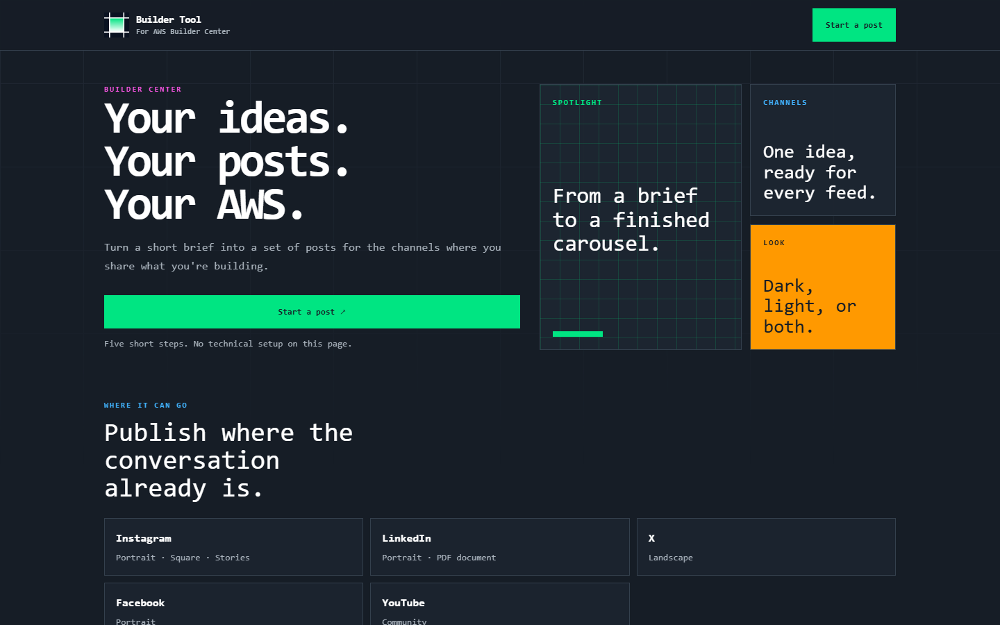

  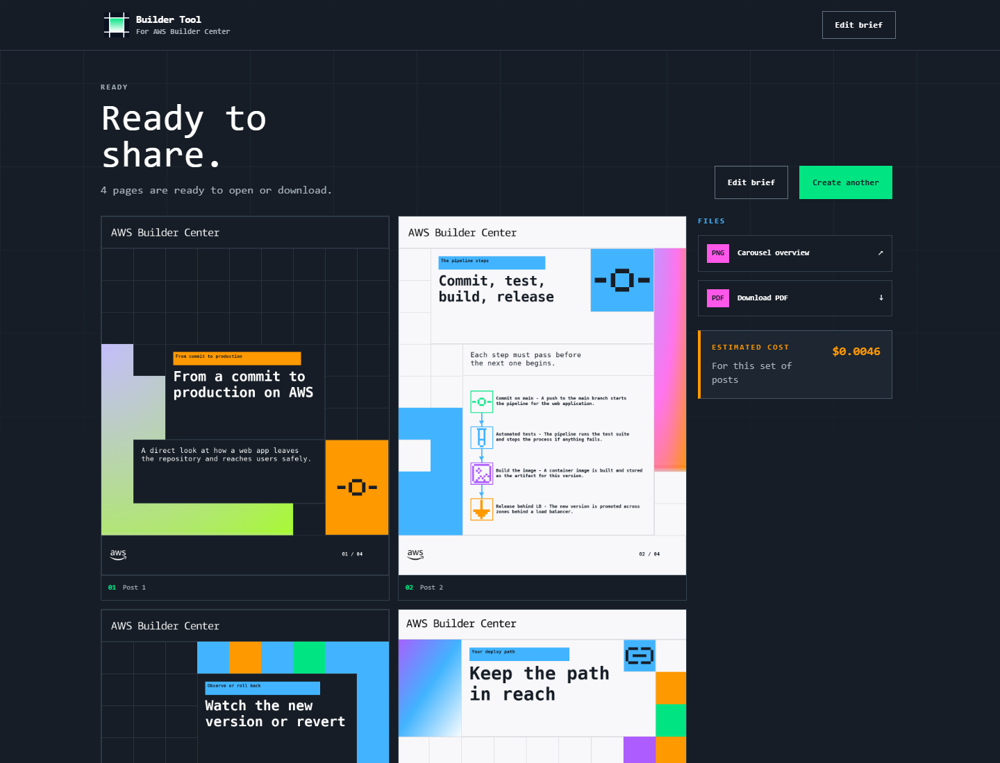

A finished set, ready to share.

## Who it is for

Builder Tool is for people who teach, write, and share what they are building on AWS. A student explaining a first pipeline. A community builder turning a talk into a carousel. A team that wants one idea to look finished on Instagram, LinkedIn, X, Facebook, or YouTube.

You do not assemble a layout. You answer a short brief, and the pages come back ready.

## Five short steps

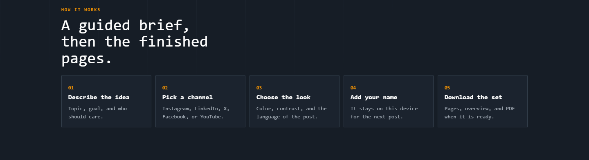

1. **Describe the idea.** Topic, goal, who should care, and the context the post has to get right.
2. **Pick a size.** A resolution recommended for a channel, how much to say, and how many pages.
3. **Choose the look.** Color, light or dark pages, and the language of the post itself.
4. **Add your name,** if you want it in the footer. It stays on this device for the next post.
5. **Download the set.** Pages, a carousel overview, and a PDF when they are ready.

The same path works on a phone. The brief stays one step at a time.

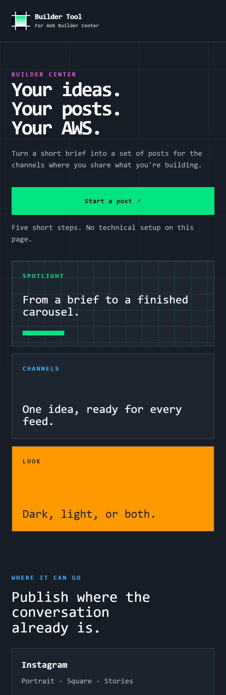

## A brief, from the first line to the last page

The set below is a real run on the live site: a post about the path from a commit to a live application, in English, at 1080 × 1350, with four pages and no personal footer.

### 1. What you are sharing

Start with the point of the post. The topic, what someone should take from it, and who it is for. Context is the room where the facts live: what must be included, what must be left out, and the sequence the pages should follow.

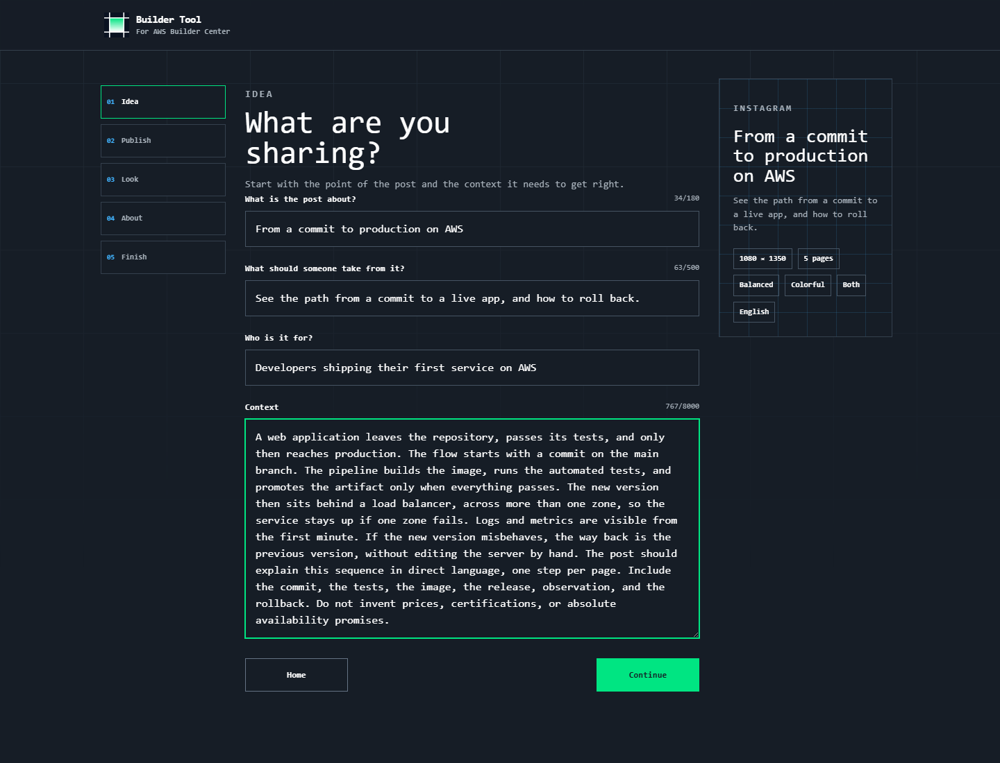

### 2. Where it belongs

Each option is a resolution, with the channel it is recommended for written inside the card.

| Resolution | Recommended for |
| --- | --- |
| 1080 × 1350 | Instagram and LinkedIn |
| 1080 × 1080 | Instagram and YouTube |
| 1080 × 1920 | Instagram |
| 1920 × 1080 | PDF / Slides |
| 1600 × 900 | X |
| 1080 × 1500 | Facebook |

Then choose how much the post should say. **Essential** keeps one idea and very little text. **Balanced** leaves room for short examples. **Deep** carries more explanation without shrinking the type. A set can be anywhere from 1 to 10 pages. This one uses four, balanced.

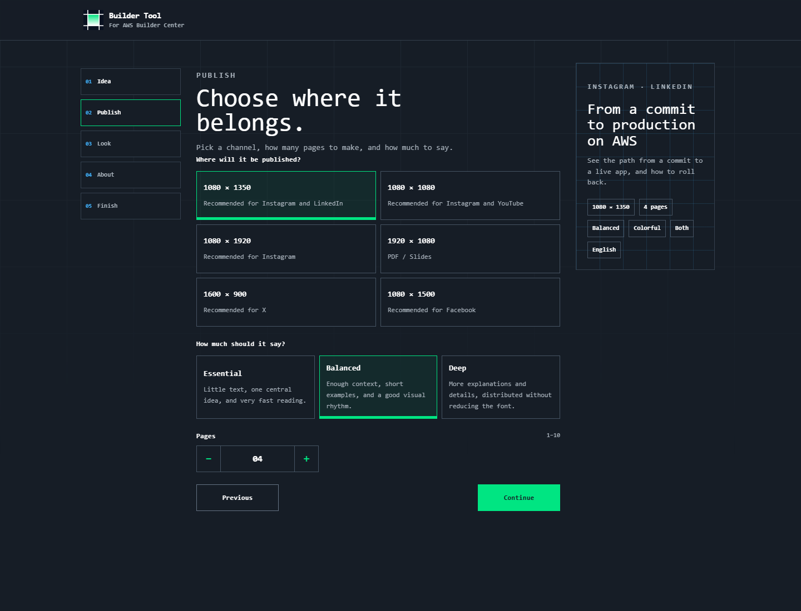

### 3. The visual direction

Pick one theme color, or **Colorful**, which carries the Builder Center palette across the set. Pages can be dark, light, or both, alternating through the carousel.

The language of the post is its own choice: English, Português, Español, Français, or Deutsch. That is the language written on the pages. It is separate from the language of the site.

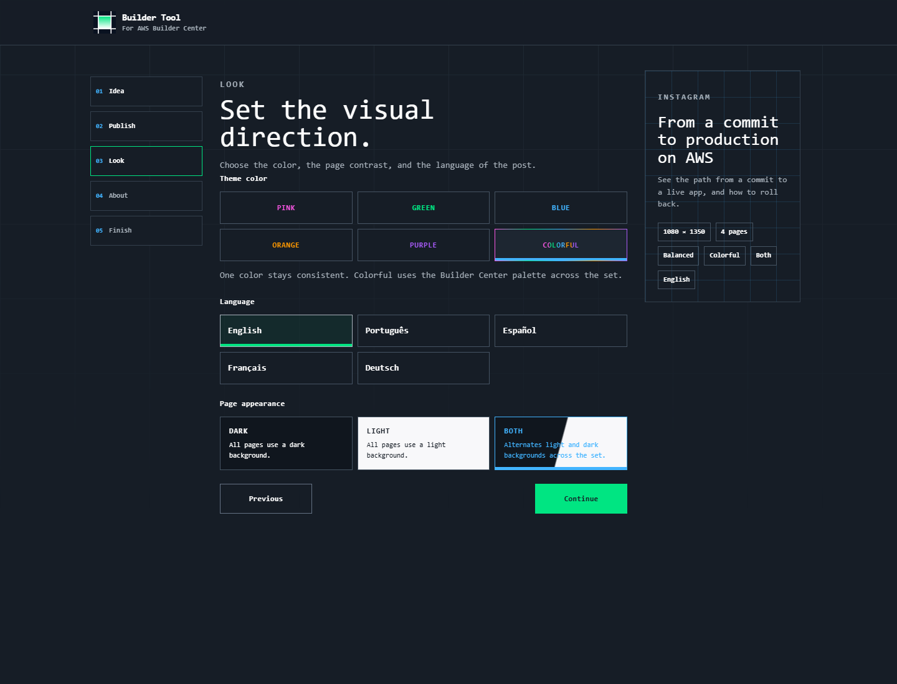

### 4. About you, when you want it

Your name, a subtitle, and a photo can sit in the footer. The photo is cropped to a square before it appears. Whatever you enter stays on this device and comes back filled in the next time you start a post.

This example leaves the footer off. The pages stand on the idea alone.

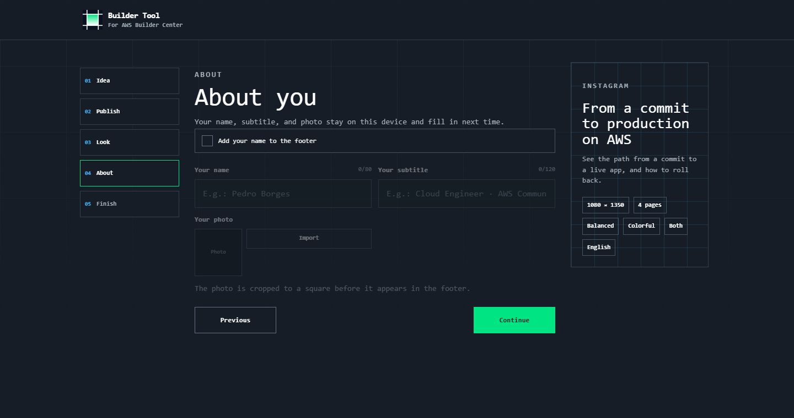

### 5. Review, then create

The last step is a call to action, if you want one, and a review of the whole brief. Each line can be edited before the pages are made. In this run the call to action is “Save this path for your next deploy.”

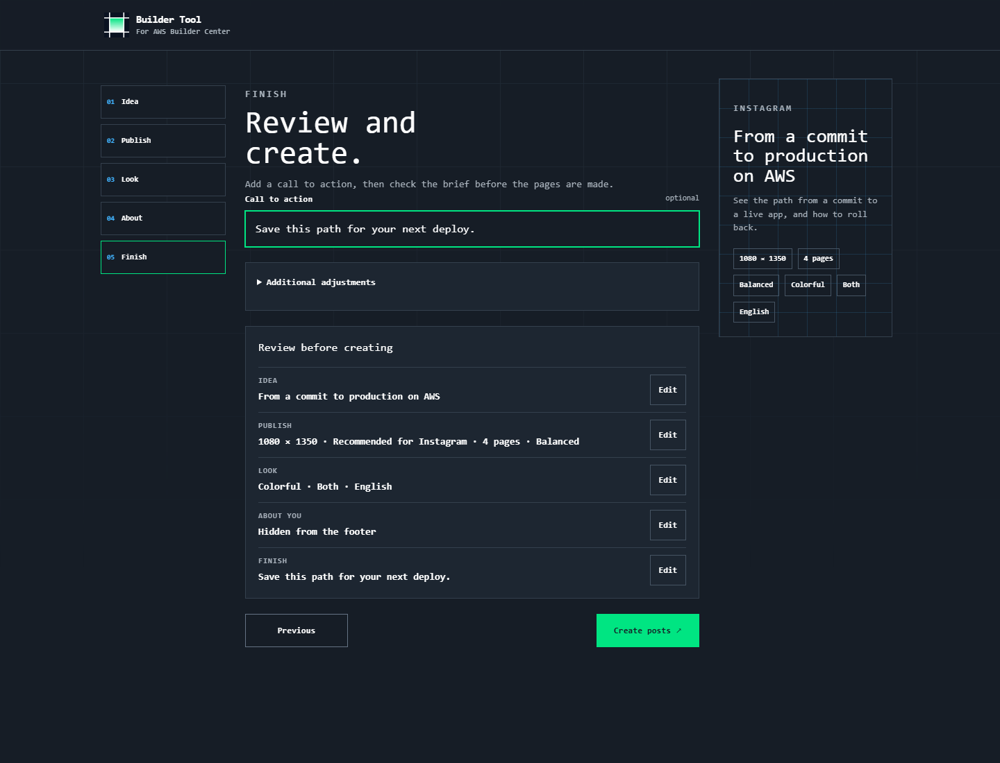

## The pages, when they are ready

Creating the set takes a moment. The pages appear in place as soon as they are finished.

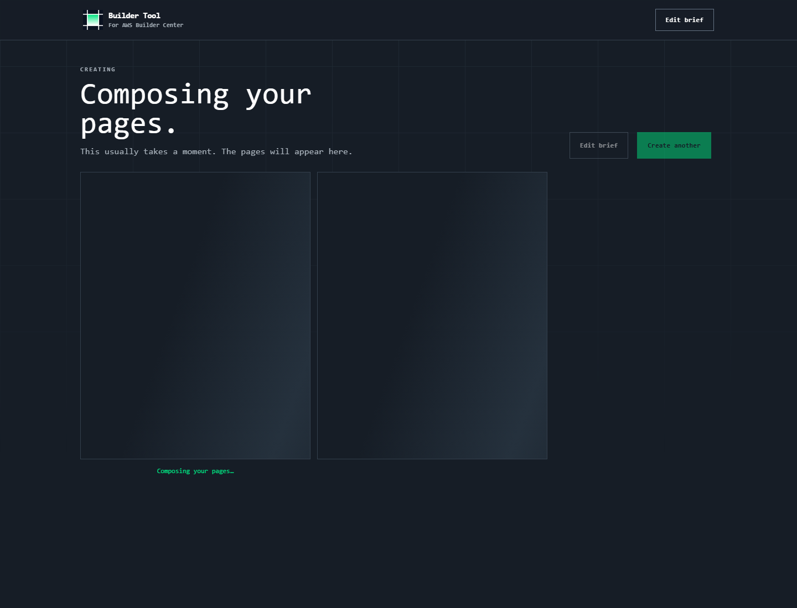

Four pages came back for this brief. Open any of them at full size, or take the whole set with you: a carousel overview, a PDF, and each page on its own. The page also shows what that set cost.

The first page of the set, open:

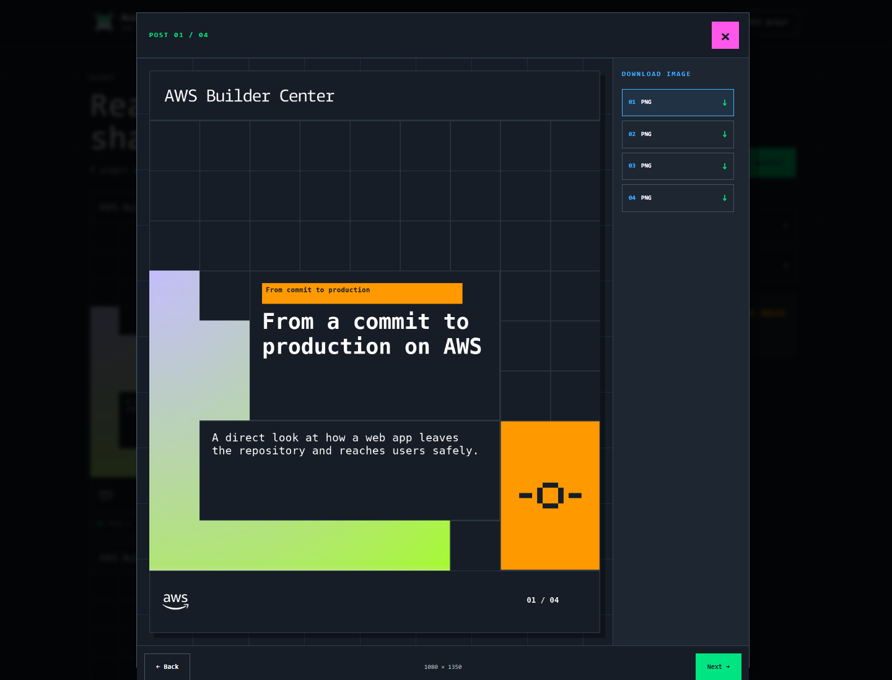

From there you can edit the brief and create the set again, or start another post.

## Start a post

Open [buildertool.app](https://buildertool.app) and choose **Start a post**.

Five short steps. The finished pages are yours to share.

## License

Builder Tool is proprietary. All rights reserved. See [LICENSE](LICENSE).
